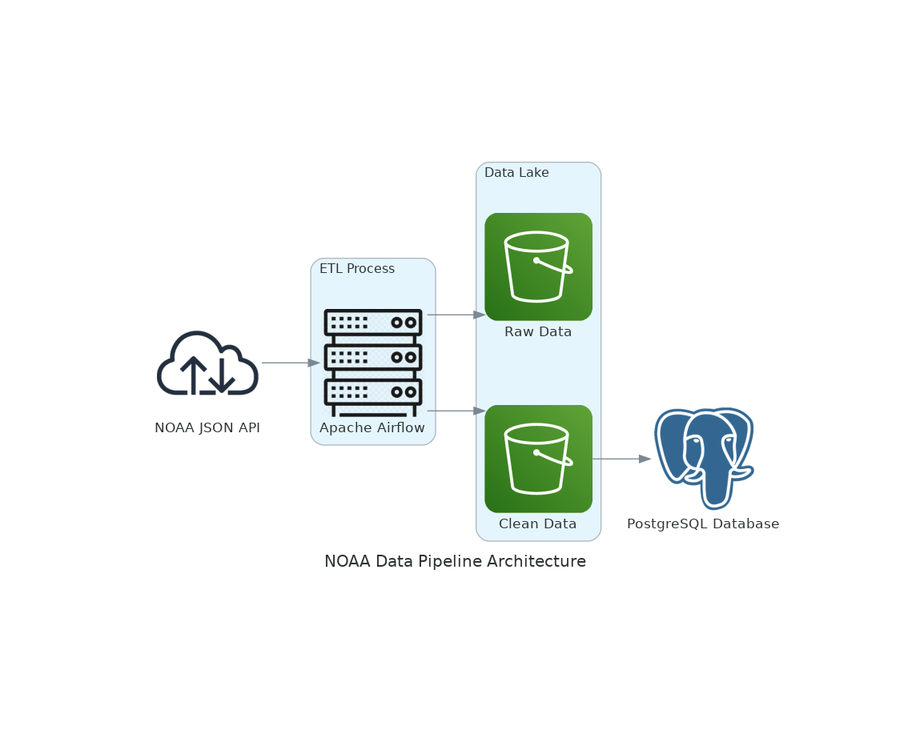

# NOAA ETL Pipeline

This project is designed to extract, transform, and load data from the NOAA (National Oceanic and Atmospheric Administration) API into a PostgreSQL database. The process involves extracting raw data in JSON format, storing it in an Amazon S3 bucket, transforming and cleaning the data, and then loading it into a PostgreSQL database for further analysis and querying.

## Table of Contents

- [Project Overview](#project-overview)
- [Architecture](#architecture)
- [Technologies Used](#technologies-used)
- [Setup Instructions](#setup-instructions)
- [Usage](#usage)

## Project Overview

The ETL pipeline in this project performs the following tasks:

1. **Extract**: Fetch raw data from the NOAA JSON API.
2. **Store**: Save the raw JSON data into an S3 bucket for persistent storage.
3. **Transform**: Clean and transform the raw JSON files, converting them into Parquet format.
4. **Load**: Load the cleaned and transformed Parquet data into a PostgreSQL database.

## Architecture

The architecture of this ETL pipeline includes the following components:

1. **NOAA JSON API**: The source of raw weather data.
2. **Amazon S3**: Used to store both raw and cleaned data files.
3. **Apache Airflow**: Manages the ETL workflow, orchestrating the extraction, transformation, and loading processes.
4. **PostgreSQL**: The database where the cleaned data is loaded for further analysis.

### Architecture Diagram



### Data Flow:

1. Data is extracted from the NOAA JSON API using an Airflow DAG (Directed Acyclic Graph).
2. The raw data is stored in an S3 bucket under a `raw_data` directory.
3. A transformation process cleans the data and converts it into Parquet format, then saves it back to S3 under a `clean-data` directory.
4. Finally, the cleaned Parquet data is loaded into a PostgreSQL database.

## Technologies Used

- **Python**: The main programming language used for data extraction and transformation.
- **Apache Airflow**: For orchestrating the ETL process.
- **Amazon S3**: For storing both raw and cleaned data.
- **PostgreSQL**: The database used to store the cleaned data.
- **Pandas**: Used for data cleaning and transformation.
- **PyArrow**: For working with Parquet files.
- **Requests**: For making HTTP requests to the NOAA API.
- **Docker**: For containerizing the services.
- **Docker Compose**: For orchestrating multi-container Docker applications.

## Setup Instructions

### Prerequisites

- Docker and Docker Compose installed on your system.
- AWS credentials configured for accessing S3.

### Installation

1. **Clone the repository**:

    ```bash
    git clone https://github.com/acosetov/noaa-etl.git
    cd noaa-etl
    ```
2. **Build and start the services**:

    Use Docker Compose to build and start all the services (PostgreSQL, Airflow, etc.):

    ```bash
    docker-compose up --build
    ```

    This command will build the Docker images and start the containers defined in the `docker-compose.yml` file.

3. **Access the Airflow web server**:

    The Airflow web server should be accessible at `http://localhost:8080`. Log in using the credentials you set upin our case `airflow_admin` as the username and `admin` as the password.

    Once logged in, you need to set up the following environment variables and connections in Airflow:

    - **Add Variables**:
        1. `NOAA_API_TOKEN`: The API token for accessing the NOAA API.
        2. `NOAA_S3_BUCKET`: The name of the S3 bucket where data is stored.

        To add these, navigate to the **Admin > Variables** section in the Airflow UI and add the variables with their respective values.

    - **Add Connections**:
        1. **`noaa-db`**: PostgreSQL connection.
            - Conn Id: `noaa-db`
            - Conn Type: `Postgres`
            - Host: The hostname or IP address of your PostgreSQL server (e.g., `postgres` if using Docker Compose).
            - Schema: The database name (`POSTGRES_DB`).
            - Login: The username for your database (`POSTGRES_USER`).
            - Password: The password for your database (`POSTGRES_PASSWORD`).
            - Port: The port number for your database (`POSTGRES_PORT`).

        2. **`noaa-s3-bucket`**: AWS S3 connection.
            - Conn Id: `noaa-s3-bucket`
            - Conn Type: `S3`
            - Extra: `{"aws_access_key_id":"your_access_key", "aws_secret_access_key":"your_secret_key"}`

        To add these, navigate to the **Admin > Connections** section in the Airflow UI and configure the connections as specified.

4. **Run the ETL pipeline**:

    Trigger the DAG to start the ETL process either through the Airflow UI or by setting a schedule.

## Usage

To run the ETL pipeline, either manually trigger the DAG from the Airflow UI or set it up on a schedule to automatically run at specific intervals.

1. **Manual Trigger**: Navigate to the Airflow web interface and trigger the DAG responsible for the ETL pipeline.
2. **Automated Runs**: Configure the DAG with a schedule interval that suits your needs (e.g., daily, hourly).